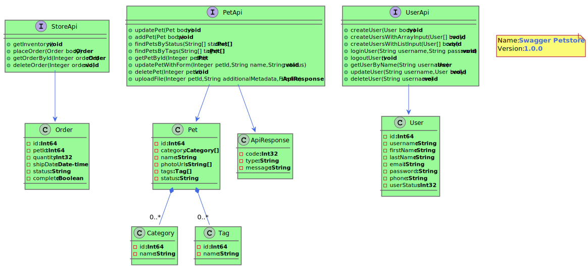

[](https://travis-ci.org/kicksolutions/swagger2puml)
[](https://oss.sonatype.org/#nexus-search;gav~io.github.kicksolutions~swagger-plantuml-core~~~)
[](https://codecov.io/gh/kicksolutions/swagger2puml)

# Swagger2Puml

Swagger to Puml convertion tool helps to generate Class Diagrams from Swagger Definition.

This Project is based on Maven and plan to support Gradle also in future.
Following are modules we currently have 

- swagger2puml-core
- swagger2puml-maven

Following are the tools which this project internally uses:

- [Swagger Parser]
- [Plant UML]
- [Graphviz]
- [Mustache]

Please [install](https://graphviz.gitlab.io/download/) Graphviz on your machines, ensure you edit PATH varible of your machine and add bin folder of graphviz.

Create a new System Variable called GRAPHVIZ_DOT and point to dot.exe for windows and dot in case of Linux in bin folder of graphviz.

# How does it work

- Swagger2Puml internally reads the swagger definition using [Swagger Parser] which then converts the Swagger Definition to swagger.puml
- Once the swagger.puml gets generated sucessfully it then calls [Plant UML] to generate swagger.svg


## swagger2puml-core: 

This utility takes Swagger Yaml as input and as response it generates swagger.puml and swagger.svg files as output.

Below is the Sample Class Diagram which gets generated.
To see the generated PUML file, please click [here](examples/swagger.puml)



### Usage:

```
java -cp swagger2puml.jar com.kicksolutions.swagger.Swagger2PlantUML [options]

-i {Path of Swagger Definition (Can be either Yaml or json)}
-o {Target location where Puml File and Image should generated}
-generateDefinitionModelOnly {true/flase Defult False (Optional)}
-includeCardinality {true/flase Defult true (Optional)}
-includeCardinality {true/flase Defult true (Optional)}
```

## swagger2puml-maven

This Maven plugin is Mojo, which internally calls swagger2puml-core to generate swagger.puml and swagger.svg for given Swagger Definition.
Swagger Definition can be either yaml or json extensions.

License
----

Apache 2.0

[Plant UML]: <https://github.com/plantuml/plantuml>
[Swagger]: <https://swagger.io/>
[Swagger Parser]: <https://github.com/swagger-api/swagger-parser>
[Graphviz]: <https://graphviz.gitlab.io/>
[Mustache]: <https://github.com/spullara/mustache.java>
